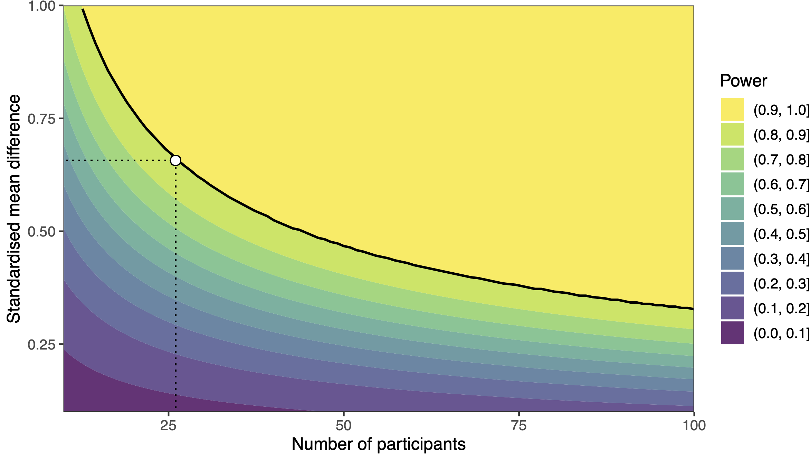

# Re-analysing the data from Moffatt et al. (2020): A textbook illustration of the absence of evidence fallacy

## Abstract

Moffatt et al. (2020) reported the results of an experiment (N = 26 in the final sample) comparing the facial electromyographic correlates of mental rumination and distraction, following an experimentally induced stressor. Based on the absence of significant difference in the perioral muscular activity between the rumination and distraction conditions, Moffatt et al. (2020) concluded that *self-reported* inner experience was unrelated to peripheral muscular activity as assessed using surface electromyography. We suggest this conclusion is at best hasty. Indeed, concluding on the absence of an effect based on an under-powered non-significant *p*-value is strongly uninformative. Moreover, the relation between self-reports and physiological measures was not directly assessed, but only indirectly inferred from differences (or absence thereof) in group averages. Given the ample inter-individual variability in these measures (as suggested by our reanalysis), we think inferring the individual-level relation between self-reports and physiological measures from group averages is inappropriate. Given these limitations, we conclude that there is limited evidence for the main conclusion put forward by Moffatt et al. (2020) and we suggest ways forward, both from a theoretical and from a methodological perspective. Complete source code, reproducible analyses, and figures are available at https://osf.io/ba3gk/.

