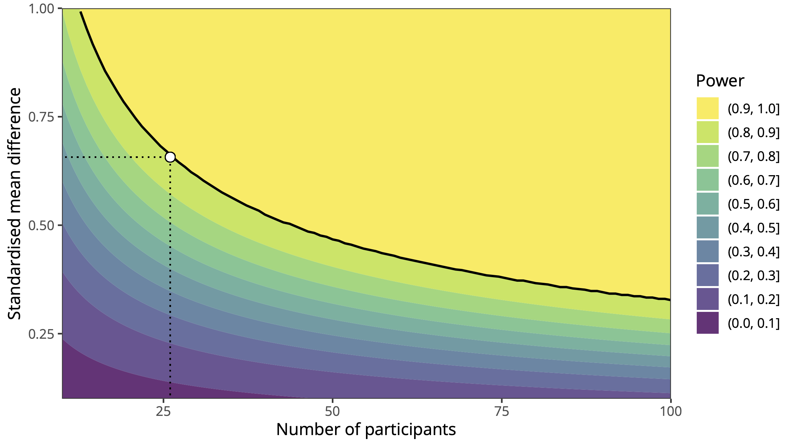

# Re-analysing the data from Moffatt et al. (2020): What can we learn from an under-powered absence of difference?

## Abstract

Moffatt et al. (2020) reported the results of an experiment (N = 26 in the final sample) comparing the facial electromyographic correlates of mental rumination and distraction, following an experimentally induced stressor. Based on the absence of significant difference (and BFs between 3.6 and 4.3) in the perioral muscular activity between the rumination and distraction conditions, Moffatt et al. (2020) concluded that *self-reported* inner experience was unrelated to peripheral muscular activity as assessed using surface electromyography. In this short commlentary, we show that there is limited evidence for the main conclusion put forward by Moffatt et al. (2020), and we suggest ways forward, both from a theoretical and a methodological perspective. Complete source code, reproducible analyses, and figures are available at https://osf.io/ba3gk/.

